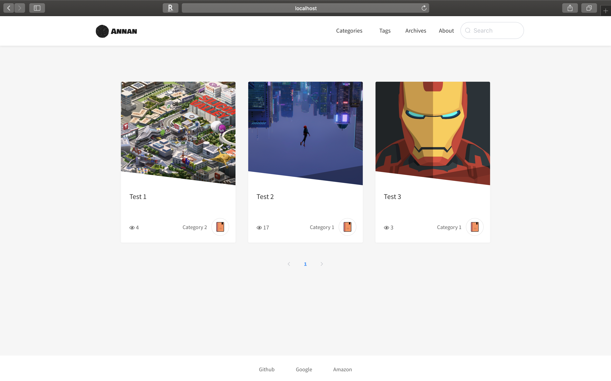
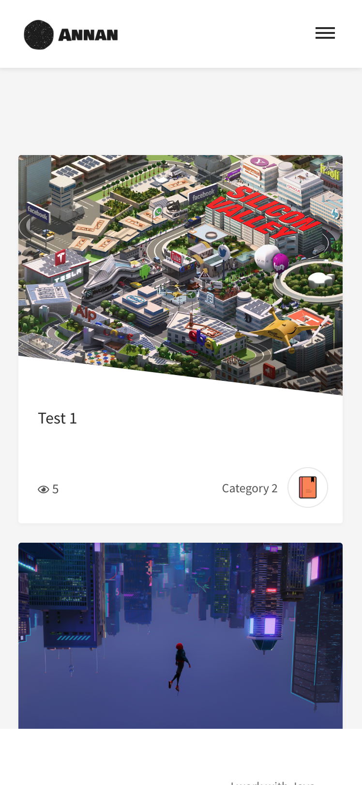
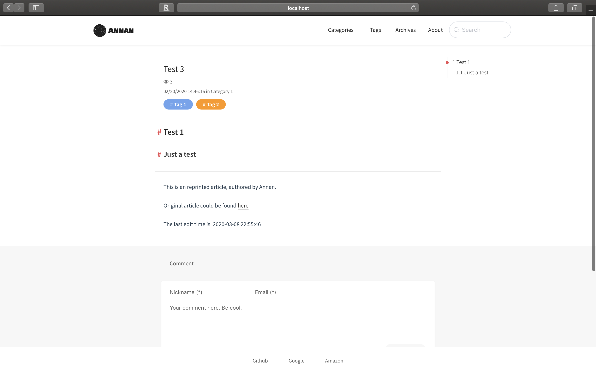
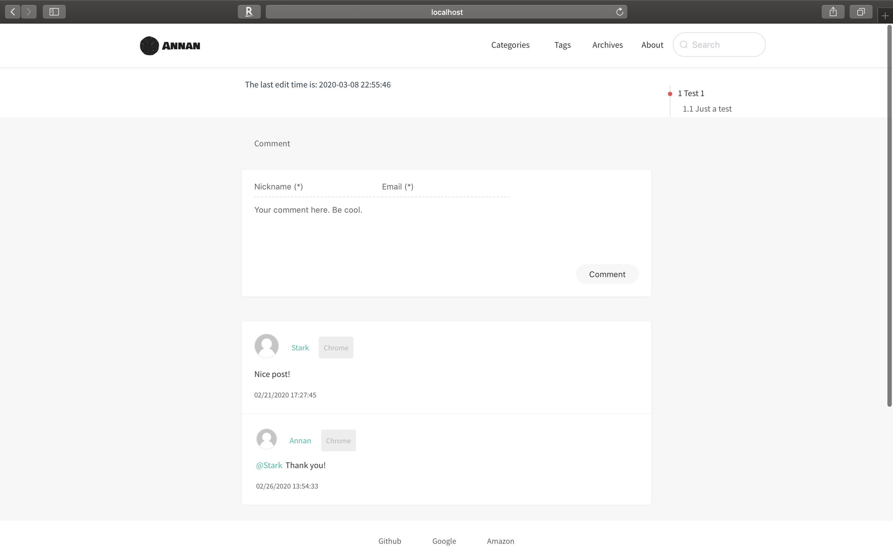
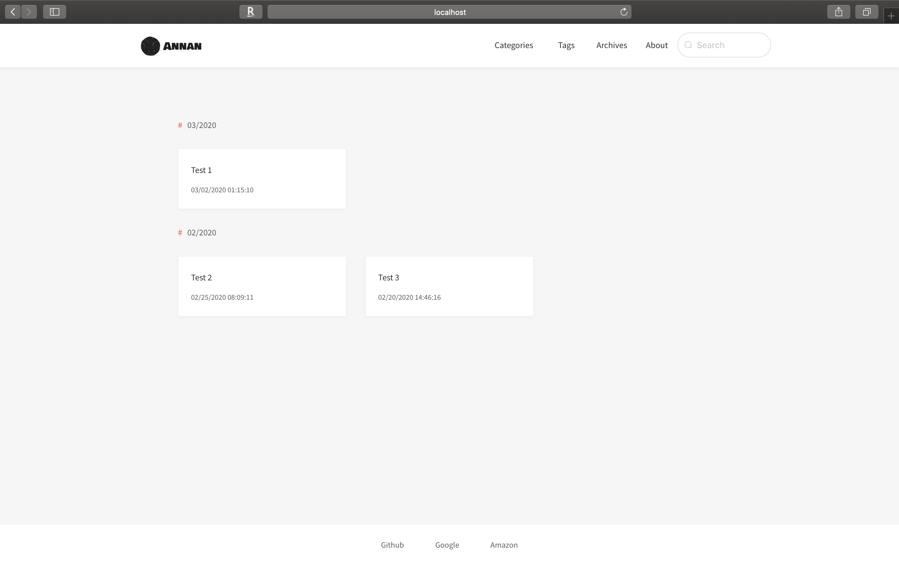
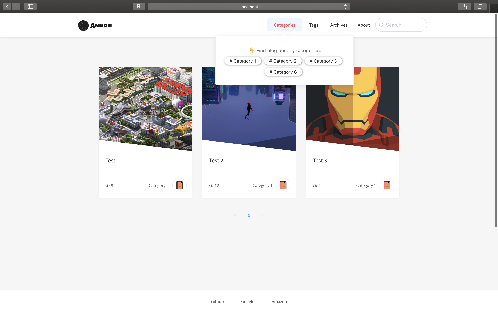
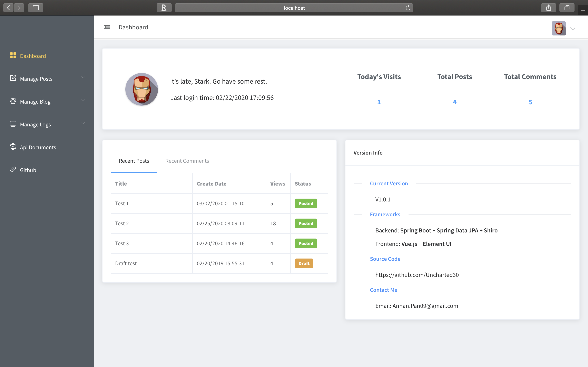
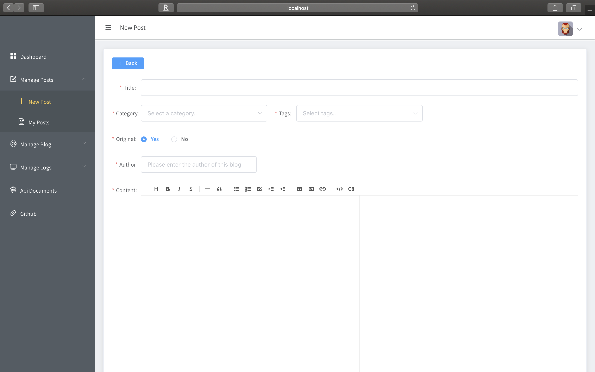
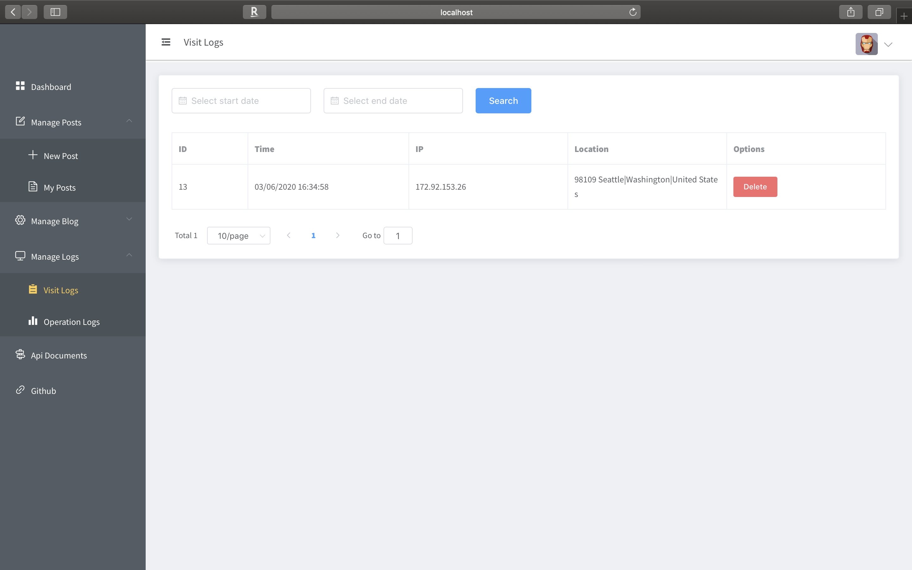
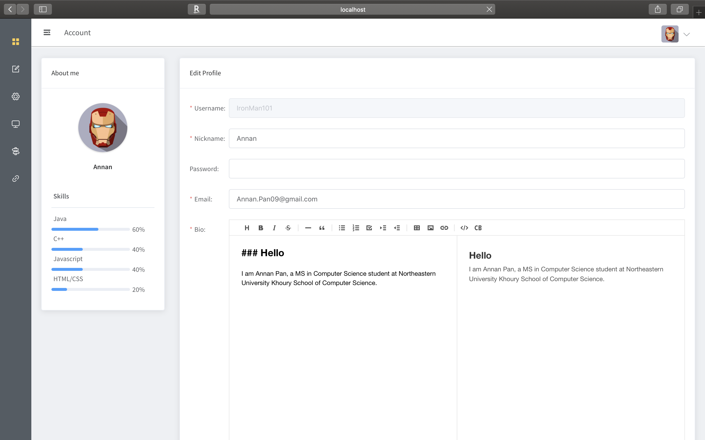

# Personal Blog 

This is a demo project, which used some widely used frameworks, such as Spring Boot, Shiro and Vue.js.
This project is a good practise for beginners.

If you like this project, please give me a star or fork this.

## How to run this blog?

This repo contains two parts：

- `api` - Java API of the blog（Spring Boot）
- `app` - A single-page web application for the blog（Vue.js）

Please run these two parts separately：

- `api` - run the main method of `BlogApplication`
- `app` - use the command `npm run dev` to start

## Contact me

- [Blog@Annan's blog](https://www.annanpan.com)

- [GitHub@Uncharted30](https://github.com/Uncharted30)

- E-mail: Annan.Pan09@gmail.com

## Previews

